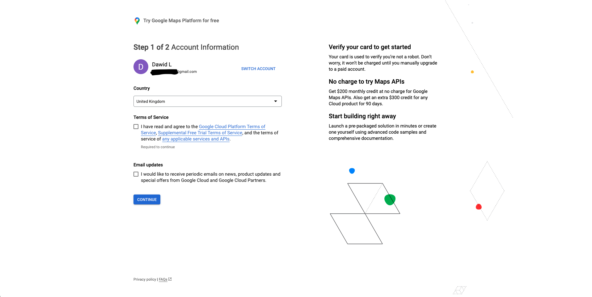

# Weather App Proxy Backend Server

The purpose of this backend application is to serve as a proxy between the
frontend application and the public APIs that require API keys. The [React Native docs](https://reactnative.dev/docs/security#storing-sensitive-info) say:

> Never store sensitive API keys in your app code.

and they go on to recommend putting a layer between the API and the React
application, which is exactly what this backend service intends to achieve.

## Obtaining necessary API keys

### Google Maps

1. Navigate to the [Google Maps Platform](https://mapsplatform.google.com/)
   in your browser.
   
2. Click the `Get started` button and log in with your Google account (or create
   one if you don't already have one)
3. Fill out your billing information. You will need to provide your credit card
   details. Google, as of time of writing, provides $200 monthly credit at no
   charge for Google Maps APIs, so you should not be charged anything as long
   as you don't exceed the free quota.
   
4. Go back to the [Google Maps Platform Cloud Console](https://console.cloud.google.com/google/maps-apis/)
   and create a new Project.
   
5. You should now see an API key modal, copy the API key to a safe place, and
   click the `Go to Google Maps Platform` button.
   
6. Select the `API restriction` and limit usage to the `Geocoding API` and
   `Places API` and click the `Restrict Key` button.
   

Your Google Maps API key should now be ready to use.

## Running the server locally

### Prerequisites

You must have [Python 3](https://www.python.org/downloads/) version 3.7 or newer installed on your system

### Create a virtual environment

Inside this directory, run

```bash
python3 -m venv venv
. venv/bin/activate
```

### Installing dependencies

Inside this directory, run

```
pip3 install -r requirements.txt
```

### Running the server

Inside this directory, run

```
GMAPS_API_KEY=<your-google-maps-api-key> python3 -m flask run -h 0.0.0.0
```

where `<your-google-maps-api-key>` is the Google Maps API key you obtained in the previous step.

Setting the host to `0.0.0.0` will expose your server on IPv4 addresses assigned to your machine, meaning you can connect to the server from other devices on the same network. The port will default to 5000, but if that is already taken by another program, change the port number to something else with the `-p <port-number>` flag appended to the end of the above command.

## Getting host IP address for React Native app connectivity on local network

In order to connect to the server from your React application, you need to find
out the IP address of the machine you are running the server on. A private IP
address will suffice when the React application is running on the same network
(e.g. home network, school network etc.) as this server. There are many ways of
getting the private IP address of your machine, and this will depend on your
system. If in doubt Google is your friend.

On linux you can run the following command:

```bash
hostname -I
```

On macOS you can use the following command:

```bash
ipconfig getifaddr en0
```

**Note**: These commands may not work on your system, depending on your configuration.
